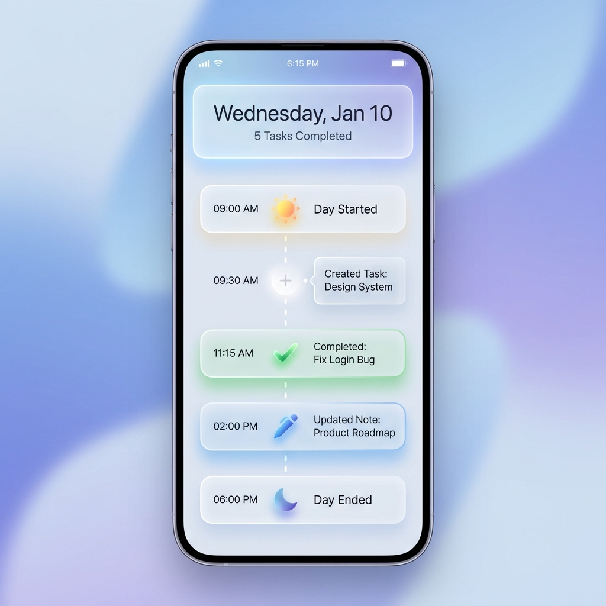

# 功能提案：时光轴复盘 (Timeline Review)

## 1. 核心概念 (Core Concept)
"时间线复盘" 不仅仅是一个功能的堆砌，它试图解决用户的 **"自我效能感" (Self-Efficacy)** 问题。
传统的 Todo App 关注 "未完成" (焦虑源)，而复盘关注 "已完成" (成就源)。

将这个功能加入项目，会显著增加产品的 **温情度** 和 **智力感**，使其从一个冷冰冰的效率工具变成一个记录成长的伙伴。

**结论**: 这是一个极佳的 **差异化点 (Differentiator)**。
*   **市场现状**: 大多数 Todo 类应用（如 Microsoft To Do）只有简单的 "Completed" 列表。TickTick 有摘要，但偏向报表。
*   **我们的机会**: 做一个 **叙事性 (Narrative)** 的时间轴。不是枯燥的列表，而是像 "朋友圈" 或 "日记" 一样的视觉流。

---

## 2. 功能设计 (Feature Design)

### V1.0 - 每日足迹 (Daily Footprints)
用户点击 "Review" 或 "复盘" 按钮，进入一个沉浸式页面（类似 Instagram Story 或 垂直时间轴）。

**视觉元素**:
*   **早安**: "你今天 09:00 开始了第一项工作"。
*   **过程**: 
    *   09:30 创建了任务 "编写设计文档" 📝
    *   11:00 完成了任务 "修复 Login Bug" ✅
    *   15:00 更新了笔记 "产品构思" 💡
*   **晚安**: "今天你专注了 X 小时，完成了 Y 个任务。辛苦了！"

### 交互方式
*   **入口**: 侧边栏 (Sidebar) 新增 "Timeline" 或 Dashboard 顶部加入 "今天" 的概览卡片。
*   **操作**: 支持在这个时间轴上补记（例如：忘打勾了，现在补上，但选时间）。

---

## 3. 技术实现方案 (Technical Implementation)

要实现"真·时间轴"，现有的数据库字段 (`created_at`, `updated_at`) 是不够的。因为它们只保存**最后状态**，不保存**过程**。

**我们需要引入 "事件溯源" (Event Sourcing) 的轻量级概念。**

### 后端变更 (Backend)

**1. 新增模型 `ActivityLog` (活动日志)**
*   这是一个 Append-only (只追加) 的表。
*   记录用户的所有关键动作。

```python
class ActivityLog(Base):
    __tablename__ = "activity_logs"
    
    id = Column(Integer, primary_key=True)
    user_id = Column(Integer, ForeignKey("users.id"))
    todo_id = Column(Integer, ForeignKey("todos.id"), nullable=True)
    
    # 动作类型: "CREATE_TASK", "COMPLETE_TASK", "UNCOMPLETE_TASK", "UPDATE_NOTE", "DELETE_TASK"
    action_type = Column(String, nullable=False) 
    
    # 发生时间
    timestamp = Column(DateTime(timezone=True), server_default=func.now())
    
    # 快照/元数据 (可选，例如当时的任务标题，防止任务被删后无法回溯)
    metadata = Column(JSON, nullable=True) 
```

**2. 拦截器/钩子 (Hooks)**
*   在 `Todo` 的 CRUD 接口中，手动或通过 SQL Alchemy Event Listener 插入 `ActivityLog`。

### 前端变更 (Frontend)

**1. 新页面 `TimelineView.tsx`**
*   使用垂直虚线连接各个节点。
*   节点根据 `action_type` 显示不同图标（✅ 完成，📝 创建，💡 灵感）。
*   支持按日期（今天、昨天）分组折叠。

**2. 状态管理**
*   需要一个新的 API `GET /activities/`。

---

## 4. 逐步实施计划 (Implementation Plan)

1.  **Phase 1 (Backend)**: 创建 `ActivityLog` 模型，并在现有 API (Create/Toggle Todo) 中埋点记录数据。
2.  **Phase 2 (Frontend)**: 原型开发。在 Sidebar 增加入口，读取日志并渲染简单的列表。
3.  **Phase 3 (Polish)**: 美化 UI。引入动画，做成类似 Chat 界面或 Path App 的优美时间轴。

---

## 5. 视觉草图 (Visual Sketch)



*图注: Timeline Review 概念设计图，展示了基于 Glassmorphism 风格的流式时间轴布局。*
